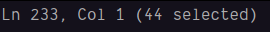
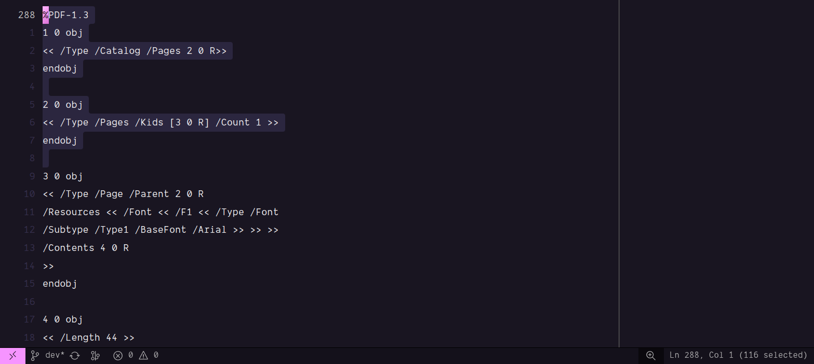

# PDF Basics series by Angeal Albertini Part 1

> [!NOTE]
> This series contain many PDF slides that you can find in his GitHub
> [here](https://github.com/angea/PDF101)

1. PDFs are series of codes that define static content of each page, in the PDF world any thing
   other than white space and new line character (\n) is ignored such as:

   - 0x00 Null
   - 0x09 Tab
   - 0xA Line Feed
   - 0x0C Form Feed
   - 0x0D Carriage Return
   - 0x20 Space

    Mixing EOL style is also possible so be careful to don't mix your style otherwise it will
    result in Offset issue that we'll talk more about it latter.

2. PDFs start with a version number: `%PDF-1.3` this is valid signature, this is kinda a comment
   that is recognized you can write comments with `%` symbol and it's valid until the end of line

3. After the signature comes the __file body__ and it's static content that is followed by __xref__
   followed by __trailer__
   ```
    %PDF-1.3
    %file body here
    xref
    %xref table here
    trailer
    %trailer content here
    startxref (this is a pointer to where xref keyword starts)
    %%EOL (lastly to mark end of line that is double percent)
   ```

   we'll learn more about all of this later

4. Name Objects: strings that start with a slash and they are case sensitive e.g. `/Name`, `/Font`
   and `/Name` != `/name`, some of the Name Objects are recognized by the parser like `/Root` and
   for debugging purposes you can change it to sth like `/root` to see what happen afterwards.

   also note that Name Object can't start with numbers

5. Dictionaries: dicts are group of key/values enclosed in double brackets `<<>>` except that every
   key has to be a name object e.g. `<</Name 1>>` that is equal to /Name = 1, in dictionaries
   white spaces are ignored and they key can be a dict itself so:

   `<</Name 1>>`: is valid
   `<<           /Name /Meow >>`: is valid
   `<</Name <<>> >>`: is valid

6. Indirect Objects: an indirect object is a object number and generation number which look sth like
   this:

   ```
   1 0 obj
   3
   endobj
   ```

   here we defined an object number 1 and generation of 0 (it's 0 almost most of the time), here
   we only declared the value of 3 but most of the time its dict `<<>>`.

   ```
   2 0 obj
   << /MyValue 1 0 R>>
   endobj
   ```

   here we defined a dict with a key of MyValue but with the value that is reference to `1 0 obj`
   object so when we want to reference to an object we declare: `objNumber objGen R` the uppercase
   `R` means reference.

7. file body: file body is sequence of indirect objects (order doesn't matter), note that a PDF
   document is defined by tree of objects

8. trailer: it's a dictionary that defines `/Root` name:
   ```
    %PDF-1.3
    1 0 obj
    <<>>
    endobj
    xref
    %xref table here
    trailer
    << /Root 1 0 R>>
    startxref (this is a pointer to where xref keyword starts)
    %%EOL (lastly to mark end of line that is double percent)
   ```

## Creating our first document

the object that `/Root` points to is a special object that refers to the page tree via pages name
and pages referes to another object that must've `/Type` key assigned to `/Pages` value and it
will define it related objects as `/Kids` key that will contain the that specific page object
reference in an array, if the Kids dict has many children it must be defined in `/Kids` dict

so as a recap obj 1 is a catalog that `/Root` points to and it contains `/Pages` that will point
to obj 2 that has `/Kids` and `/Count`.

```
%PDF-1.3
1 0 obj
<< /Type /Catalog /Pages 2 0 R>>
endobj

2 0 obj
<< /Type /Pages /Kids [3 0 R] /Count 1 >>
endobj
xref
%xref table here
trailer
<< /Root 1 0 R>>
startxref
%%EOL
```

now we need to define our `/Kids` that is a dict with `/Type` of `/Page` and you must declare its
parents `/Parent` that is obj 2.

after all of these now we need to define resources for each page, it might not make sense at first
but imagine a word document where you create a text box with a Arial font and another box below it
with other fonts all of these things are objects that have their own resources.

If you recall from the beginning a PDF document contains static resources for everything, like a
HTML document with images, etc that don't have JS yet so everything is staticly defined.

Lets try to mimic adding a textbox in our word document gui for this we must add an object that must
define it's `/Parent` page so it's basically telling where this gonna reside, after that we'll
define our static resources for this particular object (remember everything has its own static
resources), so we start with `/Resources` key that has an object as value this object contains:
`/Font` key that also gets an object related to `/Font` resources the first one is the name that is
`/F1` key followed by another object value that contains `<< /F1 << /Type /Font /Subtype /Type1
/BaseFont /Arial >>`, the first two is keys you can already guess followed by `/BaseFont` that is
the font you want to use for this text box.

the next thing we need to define is the actuall content of this textbox with `/Content` that refers
to another object that we'll create.

So for a recap we declared a `/Catalog` that contain `/Pages` (it's catalog of pages) then we
defined first page and what it contains that is obj 3, this object is properties of our page object
that will contain other objects such as texts that we will define as `/Contents`.

```
%PDF-1.3
1 0 obj
<< /Type /Catalog /Pages 2 0 R>>
endobj

2 0 obj
<< /Type /Pages /Kids [3 0 R] /Count 1 >>
endobj

3 0 obj
<< /Type /Page /Parent 2 0 R
/Resources << /Font << /F1 << /Type /Font
/Subtype /Type1 /BaseFont /Arial >> >> >>
/Contents 4 0 R
>>
endobj

xref
%xref table here
trailer
<< /Root 1 0 R>>
startxref
%%EOL
```

## Introduction to streams

So far everything is text, but a question arises here what about images and gifs or other static
contents (Binary Data ) ???

Stream Objects are objects what contain whatever you want stream object contains a stream `:)` that
comes after the first dict, note that streams can contain anything.

Back to the first dict in it will contain the `/Length` key that can assigned with another object or
a number that is length of binray data in the stream like (`/Length 5 0 R`) but for now we don't
need it.

The Stream contains other things such as `BT` (begin text) and `ET` (end text) inside of these
operators we'll define `Tf` (text font) that takes two parameters: `/F1 100 Tf`, first parameter
is the font resource in the page we declared previously and latter the font size.

Another operator that we need for the font is the location of the text for that we use `Td` operator
that takes the cordinates: `x y Td`: `10 400 Td`

The final requirement is the text itself that can be literal string, parenthesis, white space and
standard escaping `\n`, `\r\n`, note that escaping is in octal (Hell\147 World).

To declare the Text string we use `Tj` operator that takes the litral string inside parenthesis

```
4 0 obj
<< >>

stream
BT
/F1 100 Tf
10 400 Td
(Hello World) Tj
ET
endstream

endobj
```

Finally:

```
%PDF-1.3
1 0 obj
<< /Type /Catalog /Pages 2 0 R>>
endobj

2 0 obj
<< /Type /Pages /Kids [3 0 R] /Count 1 >>
endobj

3 0 obj
<< /Type /Page /Parent 2 0 R
/Resources << /Font << /F1 << /Type /Font
/Subtype /Type1 /BaseFont /Arial >> >> >>
/Contents 4 0 R
>>
endobj

4 0 obj
<< >>

stream
BT
/F1 100 Tf
10 400 Td
(Hello World!) Tj
ET
endstream

endobj

trailer
<< /Root 1 0 R>>
```

> [!Note]
> You can run save the text file as `.pdf` and run it in chrome and you can see that runs perfectly
> but this doesn't mean your PDF file is correct, most of the tools such as web browsers have high
> fault tolerance if you want to test it run it in __Adobe Reader__ if runs without any erros such
> as __Do you want to save the changes__ while you want to close it this means that the file is not
> perfect enough.

Now let's go back to our stream empty dict that is more about information about the stream, here
we must declare `/Length` key and it value must be the whole character length of the stream starting
from `BT` down to the `ET`, to calculate that highlight it follows:


then in your editor you can see the number of characters selected like this:



```
4 0 obj
<< /Length 44 >>
stream
BT
/F1 100 Tf
10 400 Td
(Hello World!) Tj
ET
endstream
endobj
```

Now our page contents is finished.

> [!Note]
> Another Tool that is mentioned in this series is Summatra and open source tool to view PDFs live
> so any changes will be appeared live, you can download it [here](https://github.com/sumatrapdfreader/sumatrapdf/releases)
> for linux you must build it yourself.


Now it's time for xref table we declared 4 objects plus 1 object that PDFs define themselves and
its null so basically we have `n + 1` objects.

```
%PDF-1.3
1 0 obj
<< /Type /Catalog /Pages 2 0 R>>
endobj

2 0 obj
<< /Type /Pages /Kids [3 0 R] /Count 1 >>
endobj

3 0 obj
<< /Type /Page /Parent 2 0 R
/Resources << /Font << /F1 << /Type /Font
/Subtype /Type1 /BaseFont /Arial >> >> >>
/Contents 4 0 R
>>
endobj

4 0 obj
<< /Length 44 >>
stream
BT
/F1 100 Tf
10 400 Td
(Hello World!) Tj
ET
endstream
endobj

xref
0 5
000000000000 65535 f\0x20
000000000010 00000 n\0x20
000000000059 00000 n\0x20
000000000115 00000 n\0x20
000000000265 00000 n\0x20

trailer
<< /Root 1 0 R /Size 5 >>
```

As you can see in the code we defined 5 tables the first line `0 5` defines the number of tables
we will define, the first table is the global table with flag of `f` that means free.

You can see 3 columns in the tables the first column is the offset column and you must calculate
each object offset like this:



the offset column lenght must be 10 then 5 zeros and then 1 letter and then a mandatory space that
I shown it as `\0x20` cause my editor trim it.

Lastly add the number of objects to the `/Size` Key in the trailer and we're done.

```
trailer
<< /Root 1 0 R /Size 5 >>
```

> [!Note]
> If you're using vscode you can install the pdf [syntax highlighter](https://marketplace.visualstudio.com/items?itemName=frinkr.pdf)
> with this extention you can also add the next setting rule for better developer experience

> [!Note]
> To prevent trimming spaces in VsCode add the following rule to your vscode setting

```
// PDF
"[pdf]": {
    "files.trimTrailingWhitespace": false
}
```

Now we need to define startxref and its a pointer to where our xref offest starts, to prevent doing
this manually you can use `mutool clean` tool to automate this step

```
startxref
359
```

Now if you open the file with Adobe Reader You should've get no errors that counts as a Victroyyyy

to continue we can use `/Filter` that basically is algorithms that you can stack on top of eachother
like `/ASCIIHexDecode` that takes any content and turns it into pure ascii that is usefull to do
tricks with it or `/FlateDecode` that implements ZIP compression and outputes HEX and it's not
editable but we can stack both to `/Filter [/ASCIIHexDecode, /FlateDecode]` to get both compression
and ascii output
